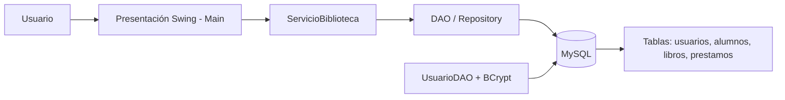

# Arquitectura


```mermaid
flowchart LR
  U[Usuario] --> UI[Presentación Swing - Main]
  UI --> S[ServicioBiblioteca]
  S --> D[DAO / Repository]
  D --> DB[(MySQL)]
  AUTH[UsuarioDAO + BCrypt] --> DB
  DB --> T[Tablas: usuarios, alumnos, libros, prestamos]
```
```
